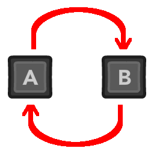

#  Godot Controls Remap

ControlsRemap will store your input mapping. It's a resource, so you can save it and load it. It supports keyboard and joypad separately. You can use it to have easily customizable controls in your game.

### How does it work?

First enable the Controls Remap addon and define what actions you want to handle in `addons/ControlsRemap/action_list` project setting. To create a remap, the resource will go over these actions and look for InputEventKey and InputEventJoypadButton. It will store the `keycode`/`button_index` of the first events it finds in the action. When the ControlsRemap is first created, it will use the currently assigned buttons as defaults, so it's important to create it before any input is edited.

The remap is applied by looking for InputEvents inside action and replacing its button id. It might sound complicated, but it's done automatically by using methods. The class includes a built-in documentation.

### Usage

First, you need to create the remap resource:
```GDScript
var remap = ControlsRemap.new()
```
Be sure to customize your actions first.

Then you can edit the assigned buttons by using `set_action_key()` for keyboard or `set_action_button()` for joypad. For example, you can listen for input and do:
```GDSCript
func _input(event):
    if event is InputEventKey:
        remap.set_action_key(current_action, event)
```
After this operation, `Input.is_action_pressed(current_action)` will use the key you just changed.

After you customized your controls, use `remap.create_remap()` to store your assigned buttons inside ControlsRemap resource. Then you can use `ResourceSaver.save("user://my_remap.tres", remap)` to save your remap to a file.

After that, instead of creating a new ControlsRemap resource, you can do:
```GDScript
var remap = load("user://my_remap.tres")
remap.apply_remap()
```
to apply your stored controls.

To sum up:
- create a ControlsRemap resource
- use `set_action_key()` or `set_action_button()` methods to customize your InputMap
- use `create_remap()` to store your InputMap keys/buttons in the remap resource
- use ResourceSaver to save it to a file and ResourceLoader to load it later
- after loading, you can replace your InputMap by using `apply_remap()`

The remap works well with [my Action Icon asset](https://github.com/KoBeWi/Godot-Action-Icon), because it allows to easily display the assigned keys. If you want to display the controls yourself, you can use `get_action_key()` and `get_action_button()` to get relevant input events.

### Notes

The remap stores *both* keyboard and joypad actions, so you can use it in your game to easily configure keyboard and joypad controls. Although your input action needs both keyboard and joypad assigned. For example:


If an action has no keyboard or joypad buttons assigned, trying to set or store them will have no effect.

The remap created with `create_remap()` will only store actions that are different from the defaults.

### Other stuff

Aside from that, the ControlsRemap has a few other useful things.

`prefix` can be used for multiplayer controls. E.g. if you have `p1_` prefix, the ControlsRemap will use `p1_jump` instead of `jump` action. This way you can have easily customizable multiplayer controls. Use multiple ControlsRemap files to store controls for many players.

Use `restore_default_controls()` to restore everything to default or `restore_action_default()` to restore one action to its default inputs.

You can use `clone_remap()` to temporarily store curreent input. For example, if you have some customized actions, but want to restore them later, you can use `clone_remap()` before going to control settings menu and then `restore_cloned_remap()` to restore the previous controls if the user cancels the settings.

Lastly, there is `find_duplicates()` method that returns conflicting actions, i.e. action names of actions that have the same key/button assigned.

___
You can find all my addons on my [profile page](https://github.com/KoBeWi).

<a href='https://ko-fi.com/W7W7AD4W4' target='_blank'></a>
